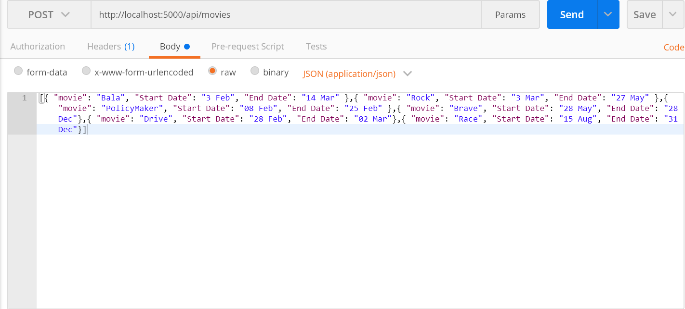
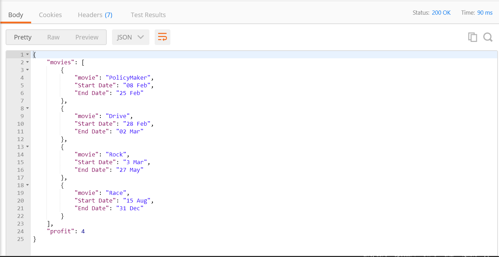

# MAX PROFIT MOVIES

## Steps to Run Backend API:

1. Clone the Repository
2. npm install
3. nodemon server.js

Server is Running at specified PORT.

## API Routes

- API[POST] : http://localhost:5000/api/movies

- Body[INPUT] :

  [{ "movie": "Bala", "Start Date": "3 Feb", "End Date": "14 Mar" },{ "movie": "Rock", "Start Date": "3 Mar", "End Date": "27 May" },{ "movie": "PolicyMaker", "Start Date": "08 Feb", "End Date": "25 Feb" },{ "movie": "Brave", "Start Date": "28 May", "End Date": "28 Dec"},{ "movie": "Drive", "Start Date": "28 Feb", "End Date": "02 Mar"},{ "movie": "Race", "Start Date": "15 Aug", "End Date": "31 Dec"}]

- Result[OUTPUT] :

  {
  "movies": [
  {
  "movie": "PolicyMaker",
  "Start Date": "08 Feb",
  "End Date": "25 Feb"
  },
  {
  "movie": "Drive",
  "Start Date": "28 Feb",
  "End Date": "02 Mar"
  },
  {
  "movie": "Rock",
  "Start Date": "3 Mar",
  "End Date": "27 May"
  },
  {
  "movie": "Race",
  "Start Date": "15 Aug",
  "End Date": "31 Dec"
  }
  ],
  "profit": 4
  }

## Testing[POSTMAN]

- INPUT

- OUTPUT

